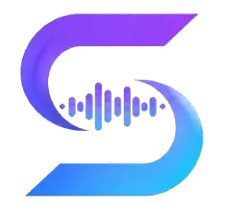

# Syncara

  

  <strong>Professional Audio & Subtitle Synchronization Workspace</strong>

  Create, edit, synchronize, and export perfectly timed subtitles, lyrics, transcripts, and captions.

  <a href="https://syncara.org"><strong>Open Syncara →</strong></a>

---

🇬🇧 <a href="#english">English</a> •
🇸🇦 <a href="#arabic">العربية</a> •
🇫🇷 <a href="#french">Français</a> •
🇪🇸 <a href="#spanish">Español</a> •
🇩🇪 <a href="#german">Deutsch</a> •
🇹🇷 <a href="#turkish">Türkçe</a> •
🇮🇩 <a href="#indonesian">Bahasa Indonesia</a> •
🇮🇳 <a href="#hindi">हिन्दी</a> •
🇵🇹 <a href="#portuguese">Português</a>

---

  

  <em>Professional synchronization workspace for subtitles, lyrics, transcripts, and captions.</em>

---

# English

## Overview

Syncara is a professional synchronization workspace designed for creators, translators, subtitle editors, educators, media teams, and accessibility specialists.

It provides a visual environment for aligning audio with text at high precision, making it easy to create subtitles, captions, lyrics, transcripts, and synchronized content for any type of media.

### Features

* Precision Timeline Editing
* Interactive Audio Waveforms
* Multi-Hour Audio Support
* Subtitle Creation & Editing
* Lyrics Synchronization
* Transcript Alignment
* Keyboard-Optimized Workflow
* Fast Import & Export
* Privacy-Focused Architecture
* Multi-Language Interface

### Supported Formats

**Import**

* TXT
* SRT
* VTT
* LRC
* JSON
* Plain Text

**Export**

* SRT
* WebVTT
* LRC
* TXT
* JSON

### Privacy

* Your content remains under your control.
* Designed with privacy and data minimization principles.
* No unnecessary collection of personal content.
* Secure and efficient editing workflows.

---

# العربية

## نظرة عامة

Syncara هي منصة احترافية لمزامنة الصوت مع النصوص والترجمات والكلمات بدقة عالية.

توفر بيئة عمل متقدمة لإنشاء الترجمات النصية، النصوص المتزامنة، ملفات الكلمات الغنائية، والمحتوى التفاعلي بسهولة واحترافية.

### المميزات

* محرر زمني احترافي
* موجات صوتية تفاعلية
* دعم الملفات الصوتية الطويلة
* إنشاء وتحرير الترجمات
* مزامنة الكلمات الغنائية
* محاذاة النصوص والتفريغات
* اختصارات لوحة مفاتيح احترافية
* استيراد وتصدير مرن
* خصوصية عالية
* دعم متعدد اللغات

### الخصوصية

* ملفاتك تبقى تحت سيطرتك.
* تصميم يركز على الخصوصية.
* عدم جمع محتوى المستخدم دون حاجة.
* بيئة عمل آمنة وفعالة.

---

# Français

## Présentation

Syncara est un espace de travail professionnel dédié à la synchronisation audio et texte.

### Fonctionnalités

* Édition précise sur timeline
* Formes d’onde interactives
* Support des fichiers audio longue durée
* Création et édition de sous-titres
* Synchronisation des paroles
* Alignement des transcriptions
* Flux de travail optimisé clavier
* Importation et exportation rapides
* Protection de la confidentialité

---

# Español

## Descripción

Syncara es un entorno profesional para sincronizar audio, subtítulos, transcripciones y letras con precisión.

### Características

* Edición avanzada en línea de tiempo
* Formas de onda interactivas
* Soporte para audio de larga duración
* Creación y edición de subtítulos
* Sincronización de letras
* Alineación de transcripciones
* Flujo optimizado con teclado
* Importación y exportación rápida

---

# Deutsch

## Übersicht

Syncara ist eine professionelle Arbeitsumgebung zur Synchronisierung von Audio, Untertiteln, Transkripten und Liedtexten.

### Funktionen

* Präzise Timeline-Bearbeitung
* Interaktive Wellenformen
* Unterstützung langer Audiodateien
* Untertitel-Bearbeitung
* Liedtext-Synchronisierung
* Transkript-Ausrichtung
* Tastaturorientierter Workflow

---

# Türkçe

## Genel Bakış

Syncara, ses ve metin senkronizasyonu için profesyonel bir çalışma alanıdır.

### Özellikler

* Hassas zaman çizelgesi düzenleme
* Etkileşimli dalga formları
* Uzun ses kayıtları desteği
* Altyazı oluşturma
* Şarkı sözü senkronizasyonu
* Transkript hizalama

---

# Bahasa Indonesia

## Ringkasan

Syncara adalah ruang kerja profesional untuk sinkronisasi audio, subtitle, transkrip, dan lirik.

### Fitur

* Timeline presisi tinggi
* Waveform interaktif
* Dukungan audio berdurasi panjang
* Pembuatan subtitle
* Sinkronisasi lirik
* Penyelarasan transkrip

---

# हिन्दी

## परिचय

Syncara ऑडियो, सबटाइटल, ट्रांसक्रिप्ट और लिरिक्स सिंक्रोनाइज़ेशन के लिए एक पेशेवर कार्यक्षेत्र है।

### विशेषताएँ

* सटीक टाइमलाइन संपादन
* इंटरैक्टिव वेवफॉर्म
* लंबे ऑडियो का समर्थन
* सबटाइटल निर्माण
* लिरिक्स सिंक्रोनाइज़ेशन
* ट्रांसक्रिप्ट अलाइनमेंट

---

# Português

## Visão Geral

Syncara é um ambiente profissional para sincronização de áudio, legendas, transcrições e letras.

### Recursos

* Edição precisa em timeline
* Waveforms interativos
* Suporte a áudios longos
* Criação de legendas
* Sincronização de letras
* Alinhamento de transcrições

---

## Supported Languages

| Language         | Code |
| ---------------- | ---- |
| English          | en   |
| العربية          | ar   |
| Français         | fr   |
| Español          | es   |
| Deutsch          | de   |
| Türkçe           | tr   |
| Bahasa Indonesia | id   |
| हिन्दी           | hi   |
| Português        | pt   |

---

## Website

https://syncara.org

---

## License

All Rights Reserved © Syncara
